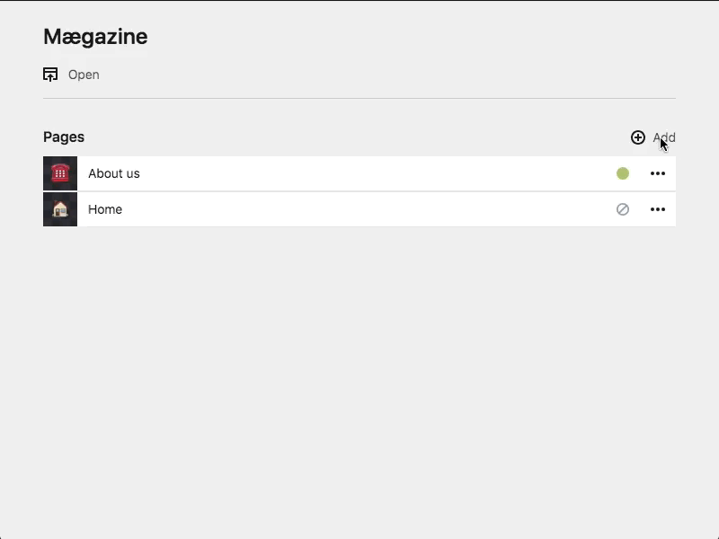

# Kirby custom Add Fields Plugin

Custom fields for Kirby's add dialog. This plugin allows to define the fields shown on Kirby's page add dialog in the corresponding
page's blueprint.



## Installation

Use one of the alternatives below.

### Download

Download and copy this repository to `/site/plugins/kirby-plugin-custom-add-fields`.

### Git submodule

```bash
git submodule add https://github.com/steirico/kirby-plugin-custom-add-fields.git site/plugins/kirby-plugin-custom-add-fields
```

### Composer

```bash
composer require steirico/kirby-plugin-custom-add-fields
```

## Usage

### Defining custom Add Fields

This plugin adds the extra property `addFields` to page blueprints.
To define custom add fields do as you would do for [defining regular fields](https://getkirby.com/docs/reference/panel/sections/fields)
but put the definition in the property `addFields`.

> `/blueprints/pages/remote.yml`:
>
>   ```yaml
>   title: Blueprint with custom Add Fields
>
>   fields:
>       # field definitions
>       title:
>           label: Title
>           type: text
>       content:
>           label: Content
>           type: textarea
>
>   # custom add fields definition
>   addFields:
>       title:
>           label: Title
>           type: text
>           required: true
>           icon: title
>
>       remoteUrl:
>           label: URL to external Content
>           type: select
>           options:
>               'https://jaspervdj.be/lorem-markdownum/markdown-html.html?no-wrapping=on': Lorem Markdownum
>               'https://raw.githubusercontent.com/steirico/kirby-plugin-custom-add-fields/master/README.md': README
>           icon: url
>   ```

### Using custom Add Fields

Values of custom add fields that correspond to fields of the page blueprint are
taken into account for the new page straightforwardly. In the example above the value of `title` in the add page dialog will be set as page's `title`.

### `slug` Handling

In order to have kirby adding pages correctly the property `slug` has to be set.
There are three ways to define a page's `slug`:

1. Add a custom add field named `slug` in order to define the `slug` manually.
1. If a field named `slug` is missing the plugin will set the `slug` based on
   the current timestamp.
1. Set/overwrite the `slug` in a pages hook script (see below).

### Using custom Add Fields in Hook Scripts

The values of the custom add fields can be used on the server side for modifying the
page to be added.

To do so one can register a [`page.create:after` hook](https://getkirby.com/docs/reference/plugins/extensions/hooks) and modify the `page` object.

The plugin also registers a generic hook which automatically detects and calls the
[page model's](https://getkirby.com/docs/guide/templates/page-models) static
method named `hookPageCreate($page)`. Define a page model and the method as follow:

> `/site/models/remote.php`:
>
> ```php
> <?php
> class RemotePage extends Page {
>     public static function hookPageCreate($page){
>         // get value of add field remoteUrl
>         $remoteUrl = $page->remoteUrl()->value();
>
>         // fetch remote content
>         $content = file_get_contents($remoteUrl);
>
>         // update page field content
>         $page->update(array(
>             'content' => $content
>         ));
>
>         // set slug according to add field title
>         $page->changeSlug(Str::slug($page->title()->value()));
>     }
> }
>```

If exceptions are thrown in `page.create:after` hooks or in `hookPageCreate($page)`,
a corresponding error is sent back to the panel, but the newly created page remains.
In such cases it is advisable to catch exceptions and delete the newly created page:

> ```php
> try {
>     // set slug according to add field title
>     $page->changeSlug(Str::slug($page->title()->value()));
> } catch (Kirby\Exception\DuplicateException $e) {
>     // A pages withe the same slug already exists.
>     // Therefore, delete the newly created one.
>     $page->delete(true);
> }
>```

### Configure Redirects

Kirby's add dialog redirects to the newly created page. Since there is [a related kirby issue](https://github.com/getkirby/kirby/issues/2377)
if slugs are changed in hooks, this behavior can not be reproduced reliably.
Therefore, the plugin's default behavior is to remain on the actual panel page after a page has been added.

If desired, redirect to the newly created page is possible on a per blueprint basis by setting the property `redirect` to `true`:

> `/blueprints/pages/parent.yml`:
>
>   ```yaml
>   title: Parent Blueprint which skips the Add Dialog
>
>   # custom add fields definition
>   addFields:
>       __dialog:
>           redirect: true
>   ```

### Force a specific Template

The template to be used for the new page can be forced by a field of the current page. By default,
if a field called `forcedTemplate` exists on the current page its value is taken into account
as template for the new page.

The field can be changed by [kirby options](https://getkirby.com/docs/guide/configuration#the-config-php):
> `/site/config/config.php`:
>
> ```php
> <?php
>
> return [
>     // exitsing configurations
>     'steirico.kirby-plugin-custom-add-fields.forcedTemplate.fieldName' => 'myForcedTemplateField'
> ];
>```

### Skip Add Dialog

The plugin allows to skip the add dialog ([see forum](https://forum.getkirby.com/t/skip-add-dialog-possible/14854)).

> `/blueprints/pages/parent.yml`:
>
>   ```yaml
>   title: Parent Blueprint which skips the Add Dialog
>
>   # custom add fields definition
>   addFields:
>       __dialog:
>           skip: true
>           forcedTemplate: remote
>   ```

Beside setting the property `skip: true` one has to define the template for the new page.
This can be achieved either by setting the property `forcedTemplate` or by the means
described in [Force a specific Template](#Force-a-specific-Template).

## Know issues

There are some known issues related to this plugin:

- Some fields Fields such as the [pages field](https://getkirby.com/docs/reference/panel/fields/pages) perform
  additional requests to the backend. Although the pages field works as of v1.1.1, such fields may not work with this plugin.
  Feel free to file an [issue](https://github.com/steirico/kirby-plugin-custom-add-fields/issues) if you
  encounter a broken field.

## License

MIT

## Credits and Contributors

- [Rico Steiner](https://github.com/steirico)
- [Nils Hörrmann](https://github.com/nilshoerrmann)
- [mvilskersts](https://github.com/mvilskersts)
